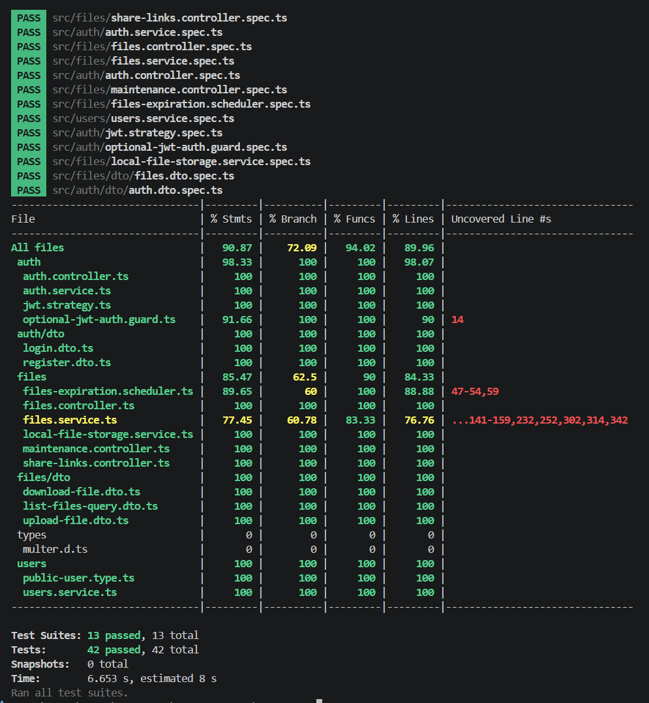
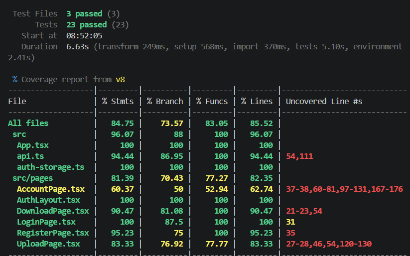
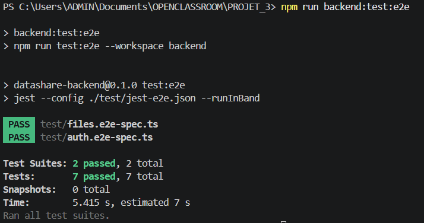

# Plan de tests

Dernière mise à jour : 2026-05-26.

## Objectif du document

Ce document décrit la stratégie de tests de l'application DataShare. Il sert à expliquer ce qui est testé, comment exécuter les tests, quels résultats sont attendus, quels critères d'acceptation valident le MVP, et quelles améliorations restent à faire pour atteindre un niveau de couverture plus confortable.

DataShare est une application de partage de fichiers composée de deux workspaces npm :

- `backend/` : API NestJS, authentification JWT, stockage local des fichiers, métadonnées PostgreSQL, purge des fichiers expirés.
- `frontend/` : interface React/Vite, pages d'authentification, upload, téléchargement public et espace utilisateur.

La stratégie de tests doit donc couvrir trois niveaux :

- tests unitaires et tests d'intégration proches du code ;
- tests end-to-end API ;
- validation manuelle ou automatisée des parcours utilisateur critiques.

## Pré-requis

Avant d'exécuter les tests, installer les dépendances depuis la racine du repository :

```bash
npm install
```

Pour les tests automatisés unitaires et d'intégration actuellement présents, aucune base PostgreSQL réelle n'est nécessaire. Les tests backend utilisent principalement des services mockés ou en mémoire, et les tests frontend mockent les appels `fetch`.

Pour tester l'application complète en local, il faut en plus préparer l'environnement backend :

```bash
cp backend/.env.example backend/.env
```

Puis adapter au besoin les variables PostgreSQL dans `backend/.env`.

## Commandes de test disponibles

Les commandes sont centralisées dans le `package.json` racine.

| Commande | Rôle | Quand l'utiliser |
| --- | --- | --- |
| `npm run backend:test` | Lance les tests unitaires backend Jest | Pendant le développement backend |
| `npm run backend:coverage` | Lance Jest avec rapport de couverture backend | Avant une livraison ou une soutenance |
| `npm run backend:test:e2e` | Lance les tests end-to-end API backend | Avant validation des routes critiques |
| `npm run frontend:test` | Lance les tests frontend Vitest | Pendant le développement frontend |
| `npm run frontend:coverage` | Lance Vitest avec rapport de couverture frontend | Avant une livraison ou une soutenance |
| `npm run backend:build` | Vérifie la compilation backend | Avant fusion ou livraison |
| `npm run frontend:build` | Vérifie TypeScript et le build Vite | Avant fusion ou livraison |
| `npm run openapi:lint` | Vérifie le contrat OpenAPI | Après modification de `docs/OpenAPI/openapi.yaml` |

## Résultats vérifiés

### Backend coverage

Résultat vérifié le 2026-05-26.

Commande exécutée :

```bash
npm run backend:coverage
```

Résultat :

- 13 suites de tests réussies.
- 42 tests réussis.
- Couverture globale statements : 90,87 %.
- Couverture globale branches : 72,09 %.
- Couverture globale functions : 94,02 %.
- Couverture globale lines : 89,96 %.

**Couverture backend Jest du 2026-05-26**



### Frontend coverage

Résultat vérifié le 2026-05-26.

Commande exécutée :

```bash
npm run frontend:coverage
```

Résultat :

- 3 fichiers de tests réussis.
- 23 tests réussis.
- Couverture globale statements : 84,75 %.
- Couverture globale branches : 73,57 %.
- Couverture globale functions : 83,05 %.
- Couverture globale lines : 85,52 %.

**Couverture frontend Vitest du 2026-05-26**



Interprétation :

Le frontend dépasse désormais l'objectif indicatif de 70 % au global. Les tests couvrent les appels API, le stockage de session, l'authentification, l'upload anonyme, l'upload connecté avec tags, la copie de lien, l'espace utilisateur et les parcours de téléchargement public.

Les zones qui restent les moins couvertes sont :

- `AccountPage.tsx`, notamment la copie, la suppression et les erreurs de chargement ;
- certaines branches d'erreur de `UploadPage.tsx` ;
- quelques messages d'erreur génériques dans `api.ts`.

Priorité d'amélioration :

1. Ajouter un test de suppression depuis l'espace utilisateur.
2. Ajouter un test d'erreur de chargement de l'historique.
3. Ajouter un test d'erreur d'upload.
4. Ajouter un test d'état vide ou de fichier sans lien copiable.

### Backend end-to-end

Résultat vérifié le 2026-05-26.

Commande exécutée :

```bash
npm run backend:test:e2e
```

Résultat :

- 2 suites e2e réussies.
- 7 tests e2e réussis.

Scénarios couverts :

- `POST /auth/register` retourne `201` et ne renvoie jamais `passwordHash`.
- `POST /auth/login` retourne un JWT et l'utilisateur public.
- Les données invalides retournent `400`.
- Des identifiants incorrects retournent `401`.
- Un email déjà utilisé retourne `409`.
- `POST /files` accepte un upload anonyme multipart et retourne un lien de partage.
- `GET /share-links/:token` permet de consulter un lien public actif.
- `POST /share-links/:token/download` télécharge le fichier partagé.
- Un lien protégé refuse un mauvais mot de passe avec `401`.
- Un lien protégé accepte le bon mot de passe et télécharge le fichier.

Interprétation :

Le e2e backend valide désormais les flux critiques d'authentification, d'upload anonyme, de consultation de lien public et de téléchargement protégé. Le dernier scénario e2e utile à ajouter concerne l'espace utilisateur connecté : upload avec JWT, historique et suppression.

## Fonctionnalités obligatoires du MVP à tester

Le MVP DataShare repose sur les fonctionnalités suivantes.

Pour les vérifications manuelles en local, utiliser le compte de test suivant :

```text
Email : test@test.com
Mot de passe : 12345678
```

Ce compte sert à valider les parcours connectés : connexion, espace utilisateur, upload rattaché au compte, consultation de l'historique et suppression.

### Création de compte

| Critère d'acceptation | Preuve de test | Statut |
| --- | --- | --- |
| Un email valide et un mot de passe valide créent un compte. | `AuthService`, `AuthController`, e2e `POST /auth/register`, test frontend de création de compte. | Validé |
| L'email est normalisé en minuscules. | `UsersService` vérifie la normalisation à la recherche et à la création. | Validé |
| Le mot de passe n'est jamais renvoyé dans la réponse. | `AuthService` vérifie le retour utilisateur public ; e2e `POST /auth/register` vérifie l'absence de `passwordHash`. | Validé |
| Un email déjà utilisé est refusé. | `AuthService` et e2e `POST /auth/register` vérifient le conflit `409`. | Validé |
| Une entrée invalide est refusée avec une erreur claire. | DTO d'authentification, e2e données invalides en `400`, test frontend de mots de passe différents. | Validé |

### Connexion

| Critère d'acceptation | Preuve de test | Statut |
| --- | --- | --- |
| Un utilisateur existant peut se connecter avec le bon mot de passe. | `AuthService` et e2e `POST /auth/login`. | Validé |
| La réponse contient un JWT et un utilisateur public. | `AuthService` vérifie le token ; e2e `POST /auth/login` vérifie `accessToken` et l'utilisateur public. | Validé |
| Une erreur de mot de passe retourne `401`. | `AuthService` et e2e identifiants invalides. | Validé |
| Le frontend stocke la session et affiche l'espace connecté. | Test frontend de connexion puis affichage de l'espace utilisateur ; tests `auth-storage`. | Validé |
| La déconnexion supprime la session locale. | Test frontend de déconnexion et vérification du `localStorage`. | Validé |

### Upload de fichier

| Critère d'acceptation | Preuve de test | Statut |
| --- | --- | --- |
| Un visiteur anonyme peut téléverser un fichier et recevoir un lien de partage. | Test frontend d'upload anonyme, test API frontend `FormData`, e2e backend `POST /files`. | Validé |
| Un utilisateur connecté peut téléverser un fichier avec des tags. | Test frontend d'upload connecté avec tags, `FilesService`, `FilesController`. | Validé |
| Les tags sont refusés pour un upload anonyme. | `FilesService` vérifie le refus métier. | Validé côté service |
| Un fichier manquant est refusé. | Règle présente dans `FilesService.upload`. | À compléter par un test |
| Les extensions dangereuses sont refusées. | Règle présente dans la configuration Multer du backend. | À compléter par un test |
| La taille maximale est bornée côté backend. | Limite configurée à 1 Gio dans `FilesModule`. | À compléter par un test ou une preuve de configuration |

### Lien de partage public

| Critère d'acceptation | Preuve de test | Statut |
| --- | --- | --- |
| Le lien contient un token non prédictible. | `FilesService` génère un token avec `randomBytes` et vérifie l'unicité ; l'e2e vérifie la présence d'un token. | Partiel |
| Le lien peut être consulté sans authentification. | E2e backend `GET /share-links/:token`, test frontend de consultation du lien. | Validé |
| Le téléchargement fonctionne via le token. | E2e backend `POST /share-links/:token/download`, test API frontend `downloadSharedFile`. | Validé |
| Si un mot de passe est défini, le téléchargement exige ce mot de passe. | E2e backend de téléchargement protégé : mauvais mot de passe `401`, bon mot de passe `200`. | Validé |
| Un lien expiré retourne `410 Gone`. | Règle présente dans `FilesService`. | À compléter par un e2e ou test service explicite |
| Un token inconnu retourne `404 Not Found`. | Parcours d'erreur frontend simulé. | À compléter côté backend |

### Espace utilisateur

| Critère d'acceptation | Preuve de test | Statut |
| --- | --- | --- |
| Un utilisateur connecté voit ses fichiers. | Test frontend d'historique utilisateur, test API frontend `listOwnFiles`, `FilesController`. | Validé |
| Un utilisateur non connecté est redirigé vers la connexion. | Test frontend `/account` sans session. | Validé |
| La liste peut filtrer les fichiers actifs ou expirés. | `FilesService` teste le filtrage des fichiers actifs ; `FilesController` transmet le statut. | Partiel |
| La suppression ne concerne que les fichiers du propriétaire. | `FilesService.deleteOwnFile` filtre par `fileId` et `ownerId` ; `FilesController` transmet l'utilisateur courant. | Partiel |
| La suppression retire aussi le fichier physique du stockage. | `LocalFileStorageService` est testé ; la purge teste la suppression physique. | À compléter pour `deleteOwnFile` |

### Expiration et purge

| Critère d'acceptation | Preuve de test | Statut |
| --- | --- | --- |
| Un lien expiré n'est plus téléchargeable. | Règle présente dans `FilesService`. | À compléter par un e2e ou test service explicite |
| La purge supprime les métadonnées et le fichier physique. | `FilesService.purgeExpiredFiles` vérifie la suppression du fichier physique et des métadonnées. | Validé |
| La purge peut être déclenchée automatiquement par intervalle. | `FilesExpirationScheduler` vérifie l'appel périodique à la purge. | Validé |
| La purge peut être déclenchée manuellement via une route protégée. | `MaintenanceController` vérifie l'appel à `purgeExpiredFiles`. | Partiel |
| La réponse de purge indique le nombre de fichiers, liens et octets supprimés. | `FilesService.purgeExpiredFiles` vérifie `purgedFiles`, `purgedShareLinks` et `purgedBytes`. | Validé |

## Scénarios end-to-end

Il y a en tout 7 scénarios, voici les résultats : 



### Scénario e2e 1 - Authentification

Statut : automatisé côté backend.

Parcours :

1. Créer un compte avec un email et un mot de passe valides.
2. Vérifier que la réponse contient un utilisateur public sans `passwordHash`.
3. Se connecter avec le compte créé.
4. Vérifier qu'un JWT est retourné.
5. Tester un mauvais mot de passe.

Critère de réussite :

- La création retourne `201`.
- La connexion retourne `200`.
- Le mauvais mot de passe retourne `401`.
- Aucune réponse ne contient `passwordHash`.

### Scénario e2e 2 - Upload anonyme et lien public

Statut : automatisé côté backend.

Parcours :

1. Appeler `POST /files` en multipart avec un fichier de test.
2. Récupérer `shareLink.token` dans la réponse.
3. Appeler `GET /share-links/:token`.
4. Appeler `POST /share-links/:token/download`.

Critère de réussite :

- L'upload retourne `201`.
- Le lien public retourne `200`.
- Le téléchargement retourne `200` avec un flux fichier.
- Le nom, la taille et le type MIME restent cohérents.

### Scénario e2e 3 - Téléchargement protégé par mot de passe

Statut : automatisé côté backend.

Parcours :

1. Appeler `POST /files` en multipart avec un mot de passe de partage.
2. Récupérer `shareLink.token` dans la réponse.
3. Vérifier que `GET /share-links/:token` indique `passwordRequired: true`.
4. Appeler `POST /share-links/:token/download` avec un mauvais mot de passe.
5. Appeler `POST /share-links/:token/download` avec le bon mot de passe.

Critère de réussite :

- L'upload retourne `201`.
- Le lien public retourne `200` et indique qu'un mot de passe est requis.
- Le mauvais mot de passe retourne `401`.
- Le bon mot de passe retourne `200` avec le fichier.

### Scénario e2e 4 - Utilisateur connecté, historique et suppression

Statut : à automatiser en e2e API ou e2e navigateur.

Parcours :

1. Créer un compte et se connecter.
2. Upload un fichier avec un JWT.
3. Lister `GET /files?status=active`.
4. Supprimer le fichier avec `DELETE /files/:fileId`.
5. Relister les fichiers.

Critère de réussite :

- Le fichier apparaît dans la liste du propriétaire.
- La suppression retourne `204`.
- Le fichier supprimé n'apparaît plus dans la liste active.
- Un autre utilisateur ne peut pas supprimer ce fichier.


## Captures de couverture à produire

Les rapports HTML sont générés par les commandes de couverture.

Backend :

```bash
npm run backend:coverage
```

Rapport à ouvrir :

```text
backend/coverage/lcov-report/index.html
```

Frontend :

```bash
npm run frontend:coverage
```

Rapport à ouvrir :

```text
frontend/coverage/index.html
```

## Routine de validation avant livraison

Avant de considérer une modification comme prête, exécuter :

```bash
npm run backend:test
npm run backend:test:e2e
npm run frontend:test
npm run backend:build
npm run frontend:build
```

Critère de validation :

- Tous les tests doivent passer.
- Les builds backend et frontend doivent passer.
- Les vulnérabilités de production doivent être à zéro ou justifiées.
- Les régressions de couverture doivent être expliquées.
- Toute baisse sous 70 % doit être accompagnée d'un plan d'amélioration.
